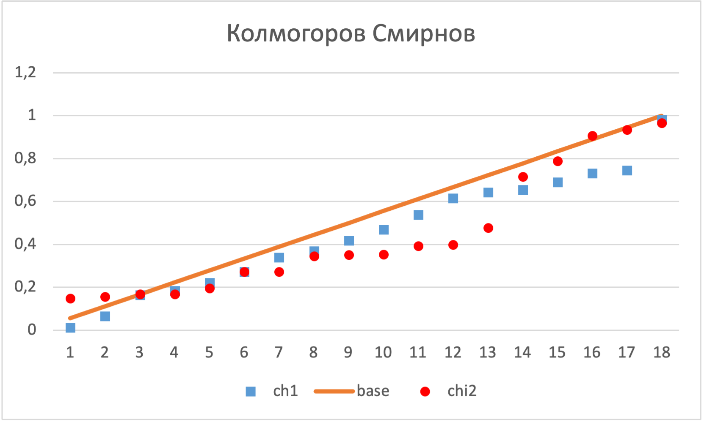
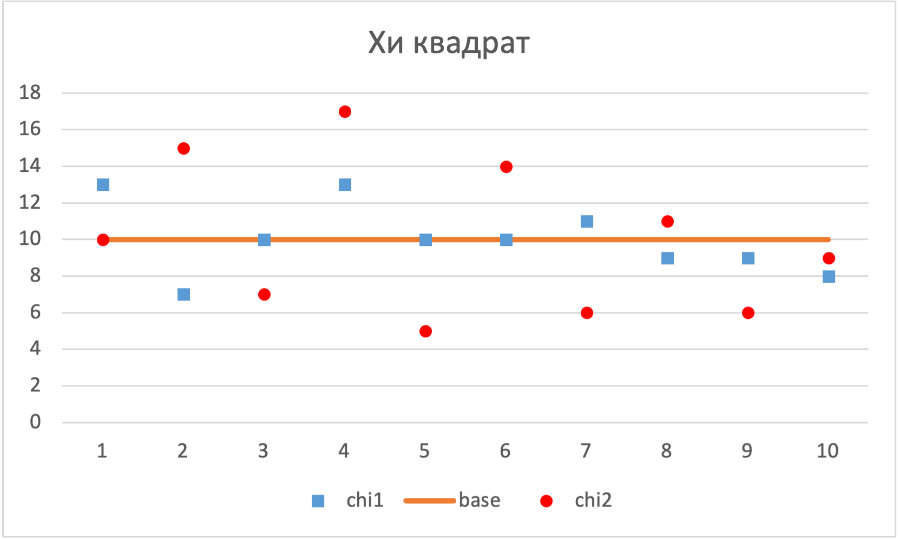
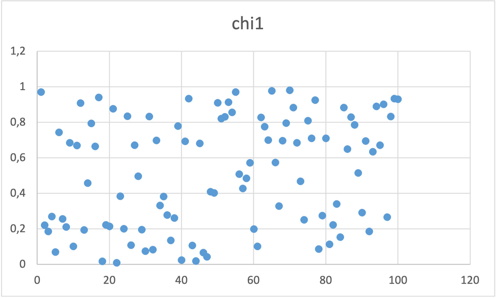
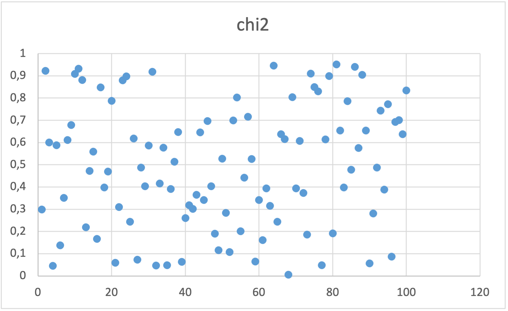

# Вторая лабораторная по "Моделирование систем"

Код - [тут](main.go)

## Описание алгоритма ГСПЧ

1. Инициализируется 32-х разрядная целочисленная переменная b
2. 32-х разрядной целочисленной переменной b присваивается текущее время в миллисекундах
3. Инициализируется 32-х разрядная целочисленная переменная y
4. Переменной y присваивается значение b \* 1220703125, тем самым переполняя переменную y
5. Если y оказывается меньше нуля, то значение y увеличивается на 2147483648
6. Инициализируется 64-х разрядная вещественная переменная r
7. Переменной r присваивается значение значение y \* 0.0000000004656613
8. Возвращается значение переменной r

## Описание тестов

### Критерий Колмогорова-Смирнова - считается наибольшее отклонение наблюдаемых значений от значений функции равномерного распределения и сравняется с табличным значением

С помощью реализованного и библиотечного алгоритмов было сгенерировано 18 значений, после чего были полученные следующие значения критерия:

- Реализованный алгоритм: 0.27608092444378607
- Библиотечный алгоритм: 0.289102301712689

Оба значения оказались меньше библиотечного D(18) = 0.309, а значит тест пройден

### Критерий Хи-квадрат - множество случайных значений разбивается на интервалы, после чего считается самое сумма отклонений наблюдаемых вероятностей нахождения случайного значения в конкретном интервале от ожидаемой вероятности нахождения случайного значения в любом из интервалов. Сумма сравнивается с табличным значением

С помощью реализованного и библиотечного алгоритмов было сгенерировано 100 значений, после чего были полученные следующие значения хи квадрат для 10 интервалов:

- Реализованный алгоритм: 7.400000000000001
- Библиотечный алгоритм: 6.799999999999999

Оба значения оказались меньше библиотечного X^2(9) = 16.9, а значит тест пройден

### Спектральный тест - множество случайных значений отображается в виде точечной диаграммы где y полученное случайное значение, а x - номер данного значения в множестве. Далее на данной диаграмме находятся непересекающиеся прямые для выявления периодичности в алгоритме ГСПЧ

Для реализованного алгоритма на двумерной плоскости непересекающиеся прямые не обнаружены, а значит тест пройден

Для библиотечного алгоритма на двумерной плоскости непересекающиеся прямые обнаружены, а значит тест пройден
