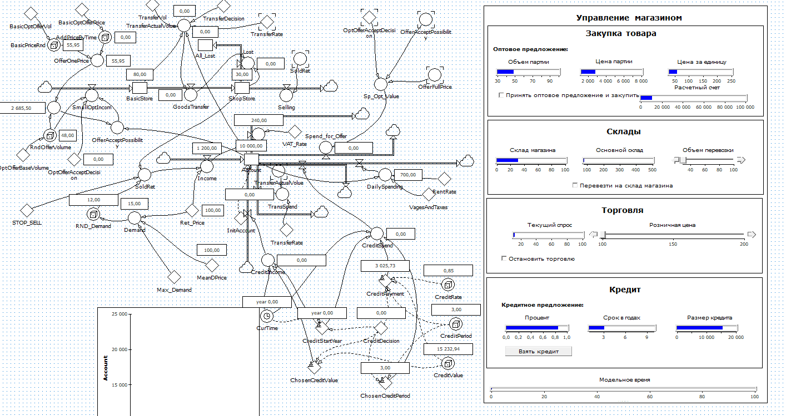
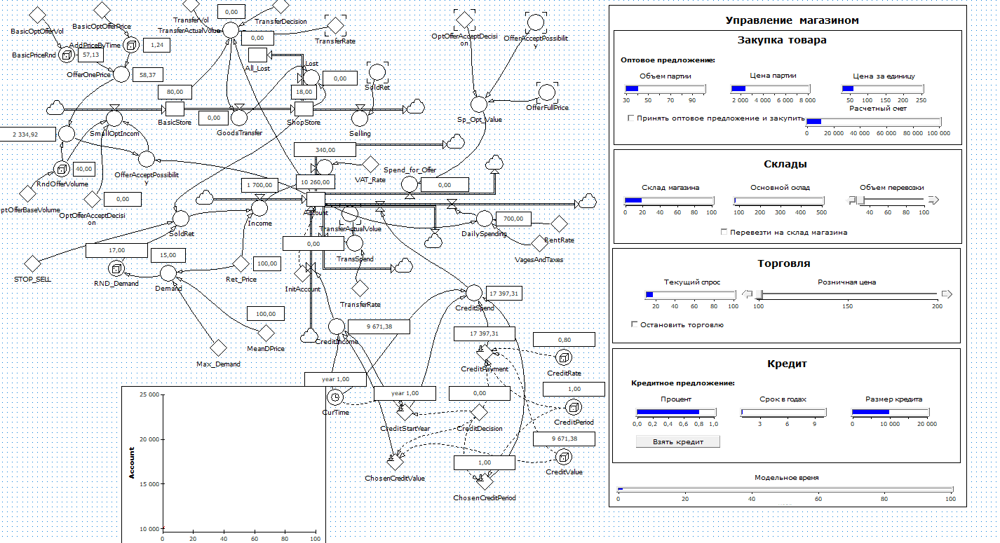
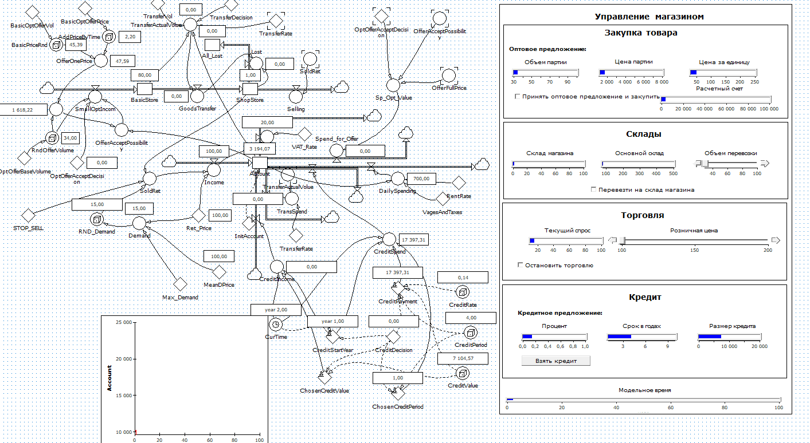

# Третья лабораторная по "Моделирование систем"

Цель: разработать и реализовать алгоритм моделирования работы магазина

## В существующую модели работы магазина был добавлен функционал кредитования

1. Пользователь в любой момент времени может взять кредит на предложенную сумму, срок и под предложенные проценты.
2. Далее до истечения срока кредитования со счета пользователя будет списываться ежегодная сумма погашения кредита.

## На основе модели был реализован алгоритм моделирования работы магазина

Код - [тут](main.go)

1. Пользователю выводится его текущий баланс, а также размер доступной для покупки партии, сумма одного товара и сумма всей партии и предлагается возможность покупки данной партии.
2. Если пользователь соглашается, и у него достаточно средств, то на базовый склад начисляются товары, а со счета пользователя списывается цена партии.
3. Далее пользователю выводится количество товаров в магазине и на общем складе и предлагается возможность перевоза товаров с общего склада в магазин.
4. Если пользователь соглашается, введя необходимое для перевозки количество, и у него достаточно средств для осуществления перевозки, а также товаров на общем складе, то выбранное количество товаров перевозится с общего склада в магазин (если по результатам перевозки в магазине оказывается товаров больше его вместимости, то лишние товары утилизируются).
5. После этого пользователю выводится текущий спрос на товары и предлагается выбрать цену, за которую будут проданы товары в магазине.
6. После ввода цены пользователем, со склада магазина продается товар равный спросу и пользователю на счет начисляется прибыль, а также списывается налог на прибыль.
7. Далее для пользователя выводится информация о кредитовании, а именно ставка, сумма и срок кредита и предлагается возможность взять кредит.
8. Если пользователь берет кредит то ему на счет перечисляется сумма кредита, и по истечение срока кредита списывается ежегодная сумма погашения.
9. На этом одна итерация моделирования работы магазина завершена.
